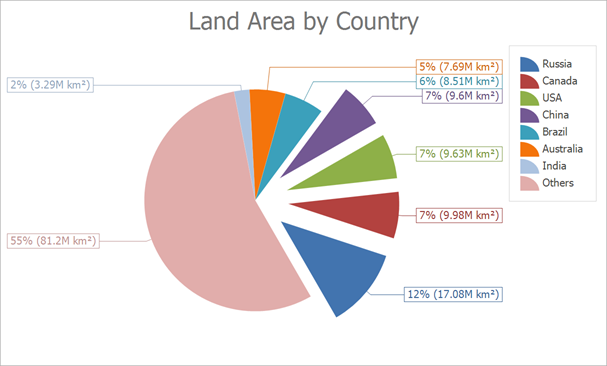

<!-- default badges list -->

<!-- default badges end -->

# Chart for WinForms - Create a Pie Chart

The following example shows how to create a [Pie](https://docs.devexpress.com/WindowsForms/2978/controls-and-libraries/chart-control/series-views/2d-series-views/pie-and-donut-series-views/pie-chart) chart at runtime.

The Chart Control uses the [Simple Diagram](https://docs.devexpress.com/WindowsForms/5906/controls-and-libraries/chart-control/diagram/simple-diagram?p=netframework) to display pies. Cast the [ChartControl.Diagram](https://docs.devexpress.com/WindowsForms/DevExpress.XtraCharts.ChartControl.Diagram?p=netframework) property to the [SimpleDiagram](https://docs.devexpress.com/CoreLibraries/DevExpress.XtraCharts.SimpleDiagram?p=netframework) type to access diagram settings. The Chart Control determines the diagram type based on the series that is added first. We recommend that you access the diagram to configure its settings after at least one series is added to the chart. 

To access pie series view settings, cast the [SeriesBase.View](https://docs.devexpress.com/CoreLibraries/DevExpress.XtraCharts.SeriesBase.View) property to the [PieSeriesView](https://docs.devexpress.com/CoreLibraries/DevExpress.XtraCharts.PieSeriesView?p=netframework) type.

## Files to Look At

* [Form1.cs](./CS/Series_PieChart/Form1.cs) (VB: [Form1.vb](./VB/Series_PieChart/Form1.vb))

## Documentation

* [Simple Diagram](https://docs.devexpress.com/WindowsForms/5906/controls-and-libraries/chart-control/diagram/simple-diagram)
* [Pie and Donut Series Views](https://docs.devexpress.com/WindowsForms/2967/controls-and-libraries/chart-control/series-views/2d-series-views/pie-and-donut-series-views)

## More Examples

* [How to: show a Pie series' total label](https://github.com/DevExpress-Examples/how-to-show-a-pie-series-total-label-t556267)
* [How to: display values both as real values and as percentages in a Pie chart's legend](https://github.com/DevExpress-Examples/how-to-display-values-both-as-real-values-and-as-percentages-in-a-pie-charts-legend-e1411)